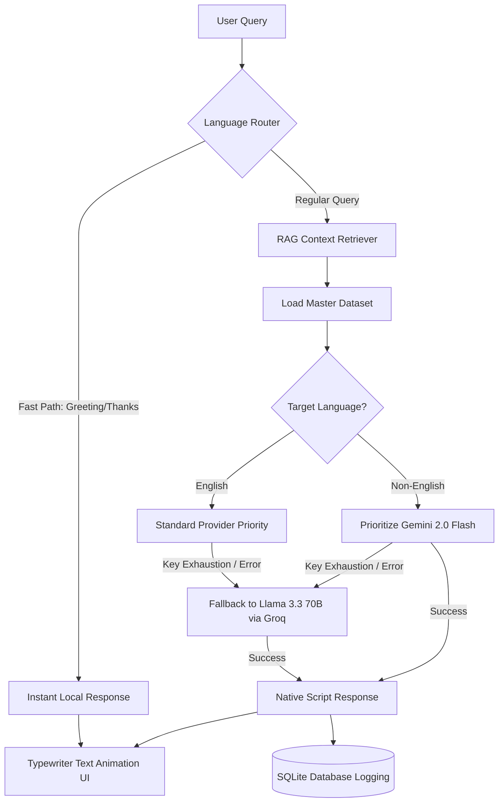

# 🎓 KPGU Multilingual AI Assistant (RAG-Based Chatbot)

An intelligent, language-agnostic virtual counselor for **Drs. Kiran & Pallavi Patel Global University (KPGU)**. The system is designed to provide high-speed, factually grounded, and conversational responses about university admissions, courses, placement statistics, and fees. It supports **English, Hindi, and Gujarati** (both in native script and transliterated Romanized inputs like Hinglish/Gujlish).

---

## ✨ Features

- **🗣️ Advanced Multilingual RAG:** Leverages Retrieval-Augmented Generation to ground answers exclusively in the `kpgu_master_dataset.txt`.
- **✍️ Transliterated (Romanized) Script Support:** Custom tokenizer and frequency-based language scorer to recognize query scripts such as:
  - *Hinglish* (`"kese ho?"`, `"admission kab shuru hoga?"`) -> Responds in native Devanagari Hindi.
  - *Gujlish* (`"kem cho?"`, `"placement vishe samjay"` ) -> Responds in native Gujarati.
- **⚡ 0ms-Latency Conversational Fast-Path:** Instant local mapping for common greetings and gratitude markers (e.g., `"kem cho"`, `"thank you"`, `"ok thanks"`) bypassing the LLM call entirely to return replies under 50ms.
- **🛡️ Smart Multi-Provider Failover & Routing:**
  - Automatically routes Indic queries (Hindi/Gujarati) to **Gemini 2.0 Flash** for high-quality native script generation.
  - Automatically falls back to **Groq (Llama-3.3-70b-versatile)** if Gemini keys run out of rate limits.
  - Pre-ordered static API keys to handle scale.
- **💬 Premium Frontend Interface:**
  - Modern React interface featuring dynamic typewriter-effect progressive text printing.
  - Detected-language tag indicator (badge displays `ENGLISH`, `HINDI`, or `GUJARATI` depending on the input script).
  - Smooth auto-scroll during response generation.
- **📊 Logging & Audit:** Automatically logs all queries, generated answers, and timestamps into a local SQLite database for session tracking and analytics.

---

## 🏗️ System Architecture



---

## 📂 Project Structure

```
.
├── backend/
│   ├── app/
│   │   ├── api/             # FastAPI Router Endpoints (Chat, Ingest)
│   │   ├── core/            # Configuration Settings (.env parsing)
│   │   ├── db/              # SQL Alchemy Database Setup & Schema
│   │   ├── schemas/         # Pydantic Requests and Response Models
│   │   └── services/        # Core RAG logic & Language Classifier
│   ├── data/                # KPGU University Information Master Dataset
│   │   ├── kpgu_info.txt
│   │   └── kpgu_master_dataset.txt
│   ├── main.py              # FastAPI Main Entry point
│   ├── requirements.txt     # Backend dependencies
│   ├── college_chatbot.db   # SQLite DB storing chat history
│   └── .env                 # Environment secrets (API keys)
│
├── frontend/
│   ├── public/              # High-res assets (logos, background)
│   ├── src/
│   │   ├── components/
│   │   │   └── ChatInterface.jsx  # Main stateful Chat component with Typewriter effect
│   │   ├── App.jsx          # Entry point
│   │   └── index.css        # Glassmorphism design and custom variables
│   ├── package.json         # Frontend dependencies
│   └── vite.config.js       # Vite bundler config
│
├── START_KPGU_BOT.bat       # One-click startup script for Windows
├── HOW_TO_START.md          # Setup walkthrough guide
└── README.md                # Comprehensive document (This file)
```

---

## 🚀 Setup & Execution Instructions

The project provides an automated setup script or can be started manually.

### Option A: Quick-Start (Recommended for Windows)

Double-click the **`START_KPGU_BOT.bat`** file at the root. It will automatically:
1. Open two terminal windows.
2. Build Python virtual environments and install packages.
3. Start the Backend server (Port `8000`).
4. Boot the Frontend client (Port `5175`).

---

### Option B: Manual Setup

#### 1. Backend Setup
Navigate to the `backend/` directory:
```bash
cd backend
```

Create a virtual environment and activate it:
```bash
# Windows
python -m venv venv
venv\Scripts\activate

# macOS/Linux
python3 -m venv venv
source venv/bin/activate
```

Install requirements:
```bash
pip install -r requirements.txt
```

Configure your API keys in the `.env` file inside the `backend/` directory:
```env
SECRET_KEY=your-jwt-secret-here
GOOGLE_API_KEY=AIzaSy... (supports comma-separated keys for rotational failover)
GROQ_API_KEY=gsk_...
```

Start the FastAPI application:
```bash
python -m uvicorn main:app --host 127.0.0.1 --port 8000
```

#### 2. Frontend Setup
Navigate to the `frontend/` directory in a new terminal:
```bash
cd frontend
```

Install packages:
```bash
npm install
```

Run the development server:
```bash
npm run dev -- --port 5175
```

Open your browser to: [**http://localhost:5175**](http://localhost:5175)

---

## 🛠️ Verification & Testing

You can run our testing suite to confirm the health of the translation, API keys, and RAG logic:

```bash
cd backend
python test_full_suite.py
```

This tests the application against a variety of:
- English, Hindi, and Gujarati queries.
- Truncated Hinglish/Gujlish tokens (e.g., `"kem cho"`, `"IT department placement vishe samjay"`).
- Rotating key failover capabilities.

---

## 🛡️ RAG Prompt Rules
The system operates under a strict factual guidance protocol:
1. **Fact-First Constraint:** Never hallucinate or guess numerical data (fees, stats). If a field is not found in the `kpgu_master_dataset.txt`, redirect to the official helpline **1800 843 9999**.
2. **Preamble-Free Style:** Starts typing answers immediately without repeating prompt definitions.
3. **Indic native output:** Responds 100% in native Gujarati or Devanagari script for non-English requests.
